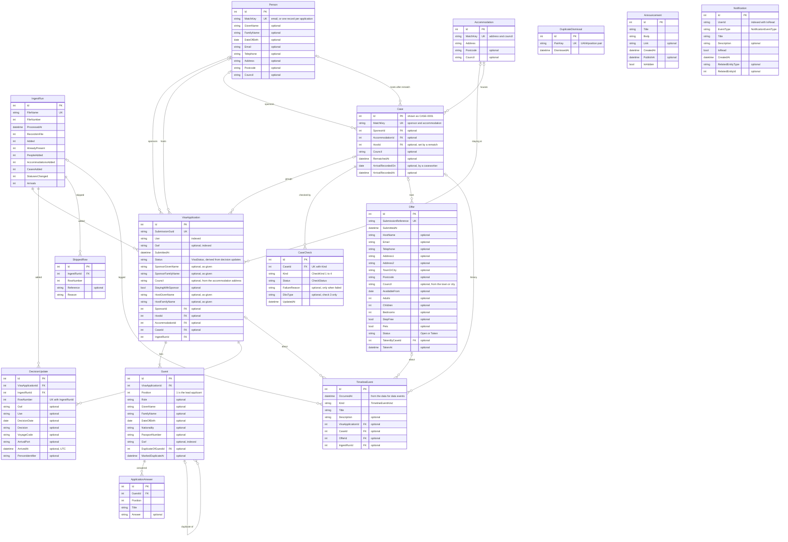

# Entity relationship diagram

The database as built: EF Core code-first on SQLite. Generated from `src/Share.Web/Models` and `Data/AppDbContext.cs`. Keep it in step with every migration.

`PK` primary key, `FK` foreign key, `UK` unique. Optional columns are marked "optional".

The image is generated from the Mermaid source below. After changing the source, run `node --experimental-websocket tools/render-erd.mjs` to regenerate `ERD.svg`.

## Notes

- **Not stored, worked out on read:** case status (from the four checks, `SafeguardingRules`), the Enhanced DBS flag and guests' ages (from dates of birth and the pinned date), "needs rematch" (any failed check), suggested duplicates (`DuplicateFinder`), the case title and its `CASE-0001` reference.
- **Stored but derived:** a visa application's `Status` is re-derived from all its decision updates on every arrivals ingest.
- **Linked by value, not by foreign key:** `DuplicateDismissal.PairKey` names two guests by application UAN and position, so it survives a reseed. `Notification.UserId` and `RelatedEntityType`/`RelatedEntityId` point at a demo user and any record. Demo users live in code (`Users/DemoUser.cs`) and a cookie, not the database.
- **Council scoping (M6):** EF global query filters limit every scoped table to the signed-in council: visa applications, guests, people, accommodations, cases, decision updates, offers and timeline events. Ingest reads with `IgnoreQueryFilters`.
- **Enums are stored as text:** `VisaStatus`, `CheckKind`, `CheckStatus`, `DbsType`, `OfferStatus`, `TimelineEventKind`, `NotificationEventType`.
